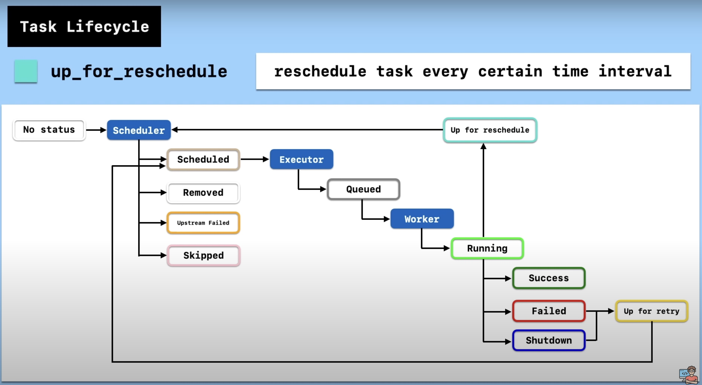

# Airflow Tutorials

Opensource tool, to create, schedule and monitor workflows. It is based on Python

## Airflow Setup

1. Instal Airflow from pip
2. Initialize DB
    
    ```bash
    	airflow db init
    ```
    
3. Start the airflow server
    
    ```bash
    airflow webserver -p 8080
    ```
    
4. Now you can access airflow server on [http://0.0.0.0:8080/](http://0.0.0.0:8080/)
5. Stop the server and create the user as it requires user credentials to login, just like django superuser to access django admin panel.
    
    ```bash
    airflow users create --username admin --firstname firstname --lastname lastname --role Admin --email admin@domain.com
    ```
    
    Than enter password for created user, user is created successfully
    
6. Start the server again, enter the credentials and you’ll see the admin panel.

## Start Airflow Scheduler

1. When you login you’ll see the below message in admin panel and inorder to start DAGs and task, scheduler should be running
    
    
    
2. Open a new terminal, export airflow home location and start scheduler
    
    ```bash
    export AIRFLOW_HOME=.
    airflow scheduler
    ```
    
    
    

## Start a DAG


<aside>
💡 **Airflow requires Airflow Webserver, Scheduler and Database to run**

</aside>

# 1. Airflow Core Concepts

## What is Airflow ?

- Worflow management platform
- Started as Airbnb internal tool in 2014 to manage complex worflows.
- The project was Opensource and beacame a Apache Incubator project in 2016
- Airflow became Apache Top level Foundation project in 2019
- Written in Python 🐍

## What is Workflow ?

- It is a sequence of tasks.
- In Airflow, workflows are defined as sequence of task in DAGs (Directed Acyclic Graph).
- DAG is the collection of all the tasks you want to run, organised in a way that reflects their dependenices and relationships.

    

## What is Task & Operator ?

- Task is defined as unit of work in DAG, in above graph a node can be said as Task (A, B, C, D, E, etc), written in python.
- Tasks are dependent on each other, like Task C is downstream of task A and upstream of task E.
- Goal here is to achieve a specific something.
- Tasks use operators to run them.
- Types of Operators:
    1. Bash Operator. → Run bash command
    2. Python Operator. → Run Python Code
    3. Customised Operator.

    

    

# 2. Airflow Task Lifecycle

- Every Task has status associated with him.
- There are total 11 status
    
    
    
- Task starts with `no_status` status

## Task Lifecycle Diagram



up_for_reschedule can be used suppose when we want a file to present in the bucket to make the task run, but still it hasn’t been there or saved, than we’ll reschedule the task for sometime later, when file is present, inorder to consumer the file in task.

## Happy Workflow:


# 3. Airflow Basic Architecture


- A [scheduler](https://airflow.apache.org/docs/apache-airflow/stable/administration-and-deployment/scheduler.html), which handles both triggering scheduled workflows, and submitting [Tasks](https://airflow.apache.org/docs/apache-airflow/stable/core-concepts/tasks.html) to the executor to run.
- An [executor](https://airflow.apache.org/docs/apache-airflow/stable/core-concepts/executor/index.html), which handles running tasks. In the default Airflow installation, this runs everything *inside* the scheduler, but most production-suitable executors actually push task execution out to *workers*.
- A *webserver*, which presents a handy user interface to inspect, trigger and debug the behaviour of DAGs and tasks.
- A folder of *DAG files*, read by the scheduler and executor (and any workers the executor has)
- A *metadata database*, used by the scheduler, executor and webserver to store state.

## Workloads

A DAG runs through a series of Tasks, and there are three common types of task you will see:

- [Operators](https://airflow.apache.org/docs/apache-airflow/stable/core-concepts/operators.html), predefined tasks that you can string together quickly to build most parts of your DAGs.
- [Sensors](https://airflow.apache.org/docs/apache-airflow/stable/core-concepts/sensors.html), a special subclass of Operators which are entirely about waiting for an external event to happen.
- A [TaskFlow](https://airflow.apache.org/docs/apache-airflow/stable/core-concepts/taskflow.html)decorated `@task`, which is a custom Python function packaged up as a Task.

# Implementation

There are 3 methods to set the task upstream or downstream

```python
# Method 1
task1.set_downstream(task2)
task1.set_downstream(task3)

# Method 2
task1 >> task2
task1 >> task3

# Method 3
task1 >> [task2, task3]
```

# Airflow Home Page containing all created DAGs


# Reference
- [Airflow Documentation](https://airflow.apache.org/docs/apache-airflow/stable/index.html)
- [YT Video](https://youtu.be/K9AnJ9_ZAXE)